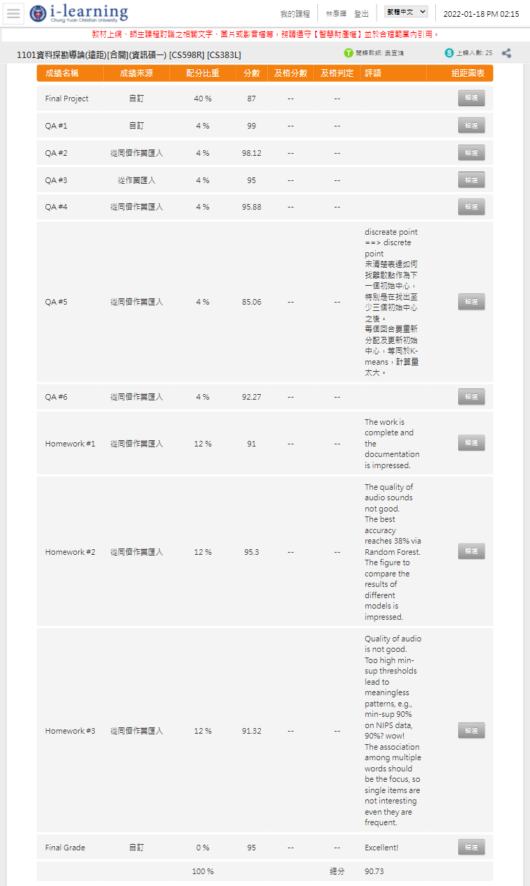

# DataMining 資料探勘導論 (110-1)

+ Author : Yan-Hui, Lin
+ Department : CYCU ICE
+ Student ID : 10727211

# Environment
+ Development environment : Anaconda JupyterNotebook (Python=3.8)
  + numpy  
      `conda install -c anaconda numpy`
  + pandas  
      `conda install -c anaconda pandas`
  + matplotlib  
      `conda install -c conda-forge matplotlib` 
  + mlxtend  
      `conda install -c conda-forge mlxtend`

# Folder
     /Senior_DataMining
     ├─ ..
     ├─ HW1
     ├─ HW2
     ├─ HW3
     ├─ QA1
     ├─ QA2
     ├─ QA3
     ├─ QA4
     ├─ QA5
     ├─ QA6
     ├─ FinalProject
     ├─ ReadMe.md
     
# Score
 